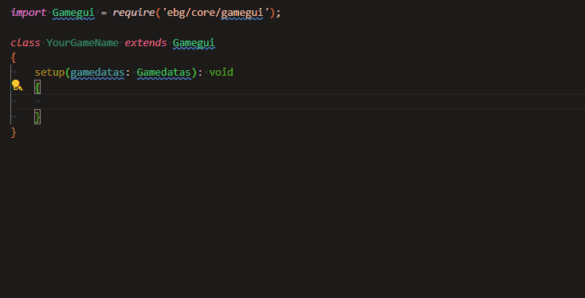
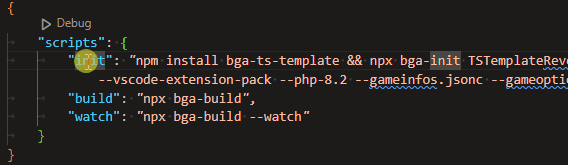

# Board Game Arena: Type Safe Template

<table><tr>
	<td> Author: NevinAF </td>
	<td> Version: 1.1.10 </td>
	<td> Date: March 18, 2024 </td>
</tr></table>

[](https://badge.fury.io/js/bga-ts-template)

BGA Type Safe Template is an npm package that includes:

- Typescript with
	- Nearly full typing for all BGA and Dojo components and heavy documentation.
	- Detailed yet simple typechecking using expandable types for game states, player actions, notifications, and gamedatas.
	- Cookbook recipes for common game mechanics and components, pulled from the BGA documentation and other sources.
- Schema files for all major BGA data files (game states, infos, options, stats, and preferences).
- SCSS support with a one-to-one replacement.
- Better PHP intellisense and error checking, as well as auto generating files and type enforcement.

*ALL of the above features are opt-in! Edit the init parameters to add/remove whatever fits your development needs*

<p align="center">
<br>
Typescript Autocomplete using BGA Type Safe Template
</p>

This project is an npm package that runs an initializer and builds scripts to assist with the development process. In addition, this prevents needing to mangle shared files with your project source keeping your project extremely small but powerful.

## Table of Contents

- [Getting Started](/README.md#getting-started)
- [Existing Project](/README.md#existing-project)
- [Package Scripts](/README.md#package-scripts)
- [Configurations](/README.md#configurations)
- [Tested With](/docs/tutorials/index.md#tested-with)

Additional Content:

- [Tutorials](/docs/tutorials/index.md)
- [Typescript README](/docs/typescript/index.md)

## Getting Started

This is a quick start guide. If you are a beginner, look at [Tutorials](/docs/tutorials/index.md) instead for a much more guided introduction to setup.

### 0. Create the BGA Project

Create the BGA project using the BGA Studio portal like you would for any game. Then, download all of the generated source files using any SFTP software.

If you need help with this section, use [Tutorials](/docs/tutorials/index.md) instead for more details.

*WIP: have SFTP setup using this package. Current issues with deleting new files when syncing generated files.*

> This step is NOT REQUIRED. The following steps can be performed on an empty folder without any issues, you will only need to copy generated files to the BGA project.

### 1. Download node.js and npm

Download node.js and npm [here](https://nodejs.org/en/download/) (if not already installed). Again, if you need help with this section, use [Tutorials](/docs/tutorials/index.md) instead for more details.

> The node.js and npm are required for Typescript compilation, even without the type safe template. BGA does not have typescript compilation for server files and everything needs to be compiled down to javascript.

### 2. Create the `package.json` file

Create a `package.json` file in the root bga project folder:

```
BGA-Project-Folder
|   img/
|   modules/
|   dbmodel.sql
|   gameoptions.json
|   ...
│   package.json       <--- Add this file
│   states.inc.php
│   ...
```

Fill the file with the following content:

```json
{
	"scripts": {
		"init": "npm install bga-ts-template && npx bga-init YourGameName \"developers\" source --typescript --scss --vscode-extension-pack --php-8.2 --gameinfos.jsonc --gameoptions.jsonc --gamepreferences.jsonc --stats.jsonc --gamestates.jsonc",
		"build": "npx bga-build",
		"watch": "npx bga-build --watch"
	}
}
```

> For existing projects with a `package.json` file, you can add the `scripts` section to the existing file as long as the package.json file is in the root of the project folder.

This contains scripts that can be run using `npm run <script-name>`. See more information about the [package scripts](/README.md#package-scripts) below.

### 3. Edit the template configuration

Edit your template configuration by modifying the arguments of the `init` script. You must replace `YourGameName` and `developers`. You can also change the `source` folder if needed.

- `YourGameName`: The upper camel case (pascal case) name of the game. This should exactly match what you used to create the game on BGA studio.
	Example: "YourGameName", "HeartsTutorial"
- `developers`: String used to populate the header of all generated files. This should contain names and emails.
	Example: "John Doe johndoe@gmail.com, Bob Smith thebuilder@cox.net".
- *(optional)* `source`: The folder where the source files are located relative to the BGA project folder. If not specified, the source folder will be `./source`. Note that this does not need to be included in the project folder. Example: `../src`.

ALL other configurations can be omitted and  only serve to add better autofill, error correction, and documentation. See [Configurations](/README.md#configurations) for more information on the configuration options.

> **Looking for typescript only?** Simply remove all options except `--typescript` from the `init` script. This will generate only the typescript files and configurations (just 3 files!). *Use `./` for the source folder if you don't want the client folder to be nested like `<source>/client`*

> Some options, like most `*.jsonc` options, might seem unneeded/redundant to some developers. Simply remove these options to avoid generating these files.

### 4. Initialize the project

Run `npm run init` in a terminal on the bga-ts-template directory (same folder with the `package.json`). This will install the necessary dependencies and create+build your project files based on the arguments.

- If you use an IDE like Visual Studio Code, there will likely be a prompt to run any tasks when looking at the `package.json` file. This will automatically run `npm run init` for you at the correct directory.

- Only the `devDependencies` that are needed by your configuration are installed. In addition, if you have any of these dependencies already installed globally, `-g`, they will not be installed locally.

- This action will overwrite ALL existing project files that are targeted by your configuration! Make sure to back up any files before running this command.

### 5. (optional) Add cookbook recipes

As of now, there are only typescript cookbook recipes, which more information can be found in the [Typescript README](/docs/typescript/index.md#cookbook) file.

------------

**Continue to the [Configurations](/README.md#configurations) section** for more information on how to use the generated files.

## Existing Project

### Typescript Conversion

The steps to convert the existing project to typescript are **extremely simple**! There are two different options when converting: A. Use `dojo.declare` with an object (matches existing), or B. using typescript classes. Option B is suggested but can require quite a bit of syntax fixing because object templates are declared differently than classes.

See more information in the [Typescript README - Existing Project Conversion](/docs/typescript/index.md#existing-project-conversion) section.

### SCSS Conversion

SCSS is a direct superset of CSS, so converting the SCSS file to a CSS file is as simple as renaming the file. The SCSS file can be broken up into multiple files, but all files must be imported into the `yourgamename.scss` file.

Follow the setup in the [Getting Started](/README.md#getting-started) section with --scss. MAKE SURE TO BACKUP ALL FILES BEFORE RUNNING `npm run init`! Then copy the contents of your existing css file to the `<source>/client/yourgamename.scss` file.

## Package Scripts

Package scripts are commands that can be run using `npm run <script-name>`. Several IDEs, like Visual Studio Code, will also include in file prompts to run these scripts:

<p align="center">
	
</p>

### `npm run init`

Used to initialize the project with the template:

- `npm install bga-ts-template`: Installs this github repository / npm package as a node_module. This will also create the bga commands.
- `&&`: Used to chain commands. This will run the next command after the previous command has finished.
- `npx bga-init <...args>`: `npx` is a node command that executes a package command. `bga-init` is a specific command in this package that copies all template files based on the configuration, and installs all node dependencies as needed. The arguments change what components are generated.

*Init is always additive and only missing files are ever generated.*

### `npm run build`

Used to build the project based on the existing files.

- `npx` is a node command that executes a package command. `bga-build` is a specific command in this package looks for existing targets and builds the project down to the bga project files.
- This command is always run after `npm run init`. The `build` command has the same behavior as `init` except it does not try to regenerate files from your configurations.
- Only existing files are used, not the configuration. For example, if the `<source>/client/tsconfig.json` file exists, typescript will always compile regardless of the `init` arguments.

### `npm run watch`

Used to watch for changes in the source files and automatically rebuild the project.

- `npx` is a node command that executes a package command. `bga-build` is a specific command in this package looks for existing targets and builds the project down to the bga project files.
- This command is identical to running `npm run build` after every change. Only files/folders that exist when starting the watch command will be watched. If you add a new file like `shared/gameoptions.jsonc`, this file will not be watched until the watch command is restarted.

## Configurations

Running `npm run init` will create modifiable files which can be used to create game specific code. Depending on what arguments are included, different files will be generated. The following is a list of all possible command line arguments.

> On its own (including the required arguments), `npm run init` will not generate any files. All configuration are opt-in.

The following, in order, should always be the first arguments listed:

- `YourGameName`: The upper camel case (pascal case) name of the game. This should exactly match what you used to create the game on BGA studio.
	Example: "YourGameName", "HeartsTutorial"
- `developers`: String used to populate the header of all generated files. This should contain names and emails.
	Example: "John Doe johndoe@gmail.com, Bob Smith thebuilder@cox.net".
- *(optional)* `source`: The folder where the source files are located relative to the BGA project folder. If not specified, the source folder will be `./source`. Note that this does not need to be included in the project folder. Example: `../src`.

### `--typescript`

A 'client' folder will be created in the source folder of this project, populated with 'yourgamename.ts', 'yourgamename.d.ts', and 'tsconfig'. As long as their exists a tsconfig in this client folder, the typescript compiler will be run on build.

See [Typescript README](/docs/typescript/index.md) for more information on the typescript files.

### `--scss`

The BGA framework expects a single css file without imports. As such, the scss command compiles a one-to-one replacement of the `client/yourgamename.scss` file to `yourgamename.css`. Your scss file can be broken up into multiple files, but all files must be imported into the `yourgamename.scss` file.

### `--vscode-extension-pack`

Board Game Arena explicitly recommends using Visual Studio Code for development. In addition, they recommend a set of extensions that help get autocompletion and static compiling. All of these extensions can be installed with one click using the [BGA Extension Pack](https://marketplace.visualstudio.com/items?itemName=NevinFoster.bga-extension-pack).

Based on those extensions, this option automatically generates settings and configs needed to set up ALL intellisense in php, json, and *.tpl (Smarty html).

This will add a `.vscode` folder with a few files based on the configuration options:

- `settings.json`. Settings for the project include:
	- [PHP Intelephense](https://marketplace.visualstudio.com/items?itemName=bmewburn.vscode-intelephense-client) extension settings for the auto included shared code and php version.
	- Enables `emmet` syntax for `*.tpl` files.
	- `json.schemas` settings for all bga-specific files.
- `sftp.json`. All settings for the [SFTP](https://marketplace.visualstudio.com/items?itemName=Natizyskunk.sftp) extension excluding the username and password. Not that this is set up to upload files that are built unlike the default settings which only upload when a files is saved from within the editor.
- `php.json`. All snippets recommended by bga for php development.

All settings are constructive and will not override/replace any existing settings. *Comments are not preserved in these files*.

### `--php-8.2`

If specified, php version 8.2.17 will be used for project files. Otherwise, php version 7.4.33 will be used. *Currently only for vscode settings*.

### `--gameinfos.jsonc`

The `gameinfos.inc.php` file will be generated using the `<source>/shared/gameinfos.jsonc` file. This makes the file easier to read and write, but is likely the least useful jsonc option.

### `--gameoptions.jsonc`, `--gamepreferences.jsonc`, `--stats.jsonc`

The `<source>/shared/<option>.jsonc` file will be use to generate their corresponding JSON/PHP file in the bga project folder. This enables schema checking and in file documentation for the game options. In addition, comments can now be added which makes documenting the usage of options much easier.

WIP - When `--material.jsonc` is enabled, all options will be added as constants for usage in the .game.php file.
WIP - When `--typescript` is enabled, any files will be added as a build type file for usage in the typescript files.

### `--gamestates.jsonc`

Like other jsonc files, the `gamestates.jsonc` file offers a more readable and writable format for the game states; however, this file has a lot of extra features
- Automatically generates the `yourgamename.actions.php` to parse player actions. This will  automatically result in compile time errors if the `yourgamename.game.php` file does not have the correct function names, or the function has the wrong signature (types are only enforced when defined).
- Autogenerate the `states.inc.php` files. This will automatically result in compile time errors if any of the state actions are not defined as functions in the `yourgamename.game.php` file.
- When `--typescript`, generates the `GameStates` and `PlayerActions` types to avoid redefining the same information for usage in the typescript files.

WIP - Defines state name constants and transition name constants for usage in the .game.php file.

## Tested With

The following is a list of repositories that have been create with the bga-ts-template, or forked from existing games and converted to the bga-ts-template. These repositories serve as a good example for how to set up more complex project while using the bga-ts-template:

- **[Tutorials](/docs/tutorials/index.md)**: The list of BGA Type Safe Template tutorials.

- **[Terraforming Mars](https://github.com/NevinAF/bga-ts-template-mars)**: Forked from https://github.com/elaskavaia/bga-mars. This game originally uses TS, but left nearly all framework types as `any`. This repository is a good example of how to convert an existing typescript project. Note that most of the changes are related to how the the modules are defined due to using `AMD` modules rather than `none`. This was a choice made to demonstrate that all BGA TS Template features still work after conversions, but not necessarily needed for an easy conversion.