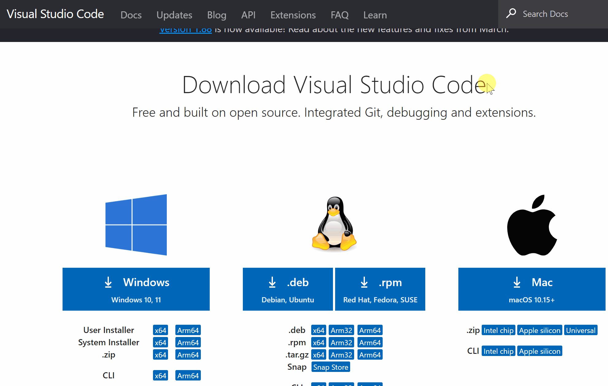

TS Template: Tutorials
===============================
[*BGA Type Safe Template*](https://github.com/NevinAF/bga-ts-template?tab=readme-ov-file#board-game-arena-type-safe-template)

All tutorials are beginner friendly and are designed to help you get started with the BGA Type Safe Template. Each tutorial will link to this page for the first four steps which are shared for any project you are working.

## Tutorial List

1. [Reversi](/docs/tutorials/reversi.md): A two player turn-based, perfect knowledge strategy game. Great starting point, meant for learning the purpose of each file and quickly getting a game up and running. Less good for learning internal components and framework.

## Step 0 - Development Environment Setup

No matter what you are doing, the first step is to always prepare your development tools. There are many different ways to set up your development environment, and many different tools to choose from.

Board Game Arena requires some sort of [SFTP client](https://en.wikipedia.org/wiki/SSH_File_Transfer_Protocol), but that's about it. Adding on to that, the Type Safe Template requires [Node.js](https://nodejs.org/en/) to initialize and build the project. Everything else is up to the developer or team.

> **S**ecure **F**ile **T**ransfer **P**rotocol (SFTP) essentially describes how to upload and download files from a network drive, not that different from Google Drive or Dropbox.

The official BGA team recommends [Visual Studio Code](https://code.visualstudio.com/) and a specific set of extensions for development. Based on this, the following steps are a quick guide for anyone who is starting from scratch or unsure of what to do.

> This is labeled as step 0 because it only ever needs to be down once. If you already have these tools installed and set up, you can skip this step.

### Recommended Tools

1. **[Visual Studio Code](https://code.visualstudio.com/)**: A code editor with a wide range of extensions and features. Using VS Code will provide automatic code completion, syntax highlighting, and many other features that make development easier. Download [VS Code here.](https://code.visualstudio.com/download)


2. **[Node.js](https://nodejs.org/en/download/)**: A JavaScript runtime which is used to initialize and build source files to 


> A node version manager is also recommended for managing multiple versions of node.

3. **[Node Package Manager (npm)](https://docs.npmjs.com/about-npm)**: A package manager for JavaScript. This will be used to automatically install and manage the dependencies,including the BGA Type Safe Template.

	Once you have node.js installed, you can install npm by simply running the following in the terminal:

	```bash
	npm install -g npm
	```

4. **[BGA Extension Pack](https://marketplace.visualstudio.com/items?itemName=nevinfoster.bga-extension-pack)**: A collection of VS Code extensions that are useful for BGA development. This includes syntax highlighting for BGA files, a BGA icon theme, and more.

5. (optional) **[Git](https://git-scm.com/downloads)**: One of the most populate version control systems. This is used to track changes to your code and collaborate easily with others. Nearly all BGA developers use [GitHub](https://github.com) to share their code, which is built on top of Git.

<table><tr>
	<td></td>
	<td></td>
</tr><tr>
	<td></td>
	<td></td>
</tr></table>

## Step 1 - Create a New Project

1. Go to [studio.boardgamearena.com](https://studio.boardgamearena.com) and login. Then navigate to your [manage games](https://studio.boardgamearena.com/studio) page:

	- Click on your profile icon on the top right of any page.
	- Click on the Control Panel button on the top right. This is only visible if you are on a developer account.
	- Click on the Manage Games button on the left side of the page.

	<p align="center">
		
	</p>

2. **Create new project**. You only need to fill out the name of the game, usually something like `<UserName>Tutorial<Game>` for a first project.

> This should always be in upper camel case (Pascal Case) with no spaces or special characters. This is because the project name is used in the URL of the game, and the URL is case sensitive.

3. **Create a local folder** for the project files. Something like `C:\Users\<UserName>\Documents\BGA\<project-name>` is a good place to start.

4. **Use SFTP client to download the project files** to the folder you just created. If you are using the recommended tools for development, you can do the following:

	a. **Open the new folder in VS Code**. You can open VS Code and use the `File > Open Folder` to open the specific folder you created.

	b. **Run the [SFTP: Config](command:sftp.config) command**. You can do this by pressing `Ctrl+Shift+P` (or `F1`) to open the command palette, then typing `SFTP: Config` and pressing enter.

	c. **Paste the following** into the created `.vscode/sftp.json` file, then update the username, password, and remotePath fields with your own information. The username and password will have been emailed when signing up for a developer account::

	```json
	{
		"name": "BGA",
		"host": "1.studio.boardgamearena.com",
		"protocol": "sftp",
		"port": 22,
		"username": "___YourUsername___",
		"password": "___yourpassword_hexstring___",
		"remotePath": "/___lowercaseprojectname___/",
		"ignore": [
			".vscode",
			".git",
			".idea",
			".gitignore",
			".DS_Store",
			"node_modules",
			"package-lock.json",
			"yarn.lock",
			"nmp-debug.log",
			"yarn-error.log",
			"source/client/build"
		]
	}
	```

	d. **Run the [SFTP: Sync Remote -> Local](command:sftp.sync.remoteToLocal)** command. This will download all initial files from the BGA server to your local folder.

<p align="center" width="50%">
	
</p>

> When viewing files in VS Code, the php files will have errors because the shared codes in not yet linked. This will be resolved in the next step.

5. **Run the game** to make sure everything is working correctly. You can run tests filled with your developer accounts by using `Express Start` when setting up to play a game.

	- Navigate to the `Manage Games` page as described in step 1.1.
	- Click on any games in your list of games.
	- Click on `Play` from within the list of options on one of your game's versions.
	- Click on `Create A Table`.
	- Click on `Express Start`.

<table><tr><td>

</td><td>

</td></tr></table>

> You can play as any of the connected developer accounts by clicking on the red `>` next to any of the players' names.

## Step 2 - Initialize the BGA Type Safe Template

1. **Create a `package.json` file**, and fill it with the following contents:

```json
{
	"scripts": {
		"init": "npm install bga-ts-template && npx bga-init YourGameName \"developers\" source --typescript --scss --vscode-extension-pack --php-8.2 --gameinfos.jsonc --gameoptions.jsonc --gamepreferences.jsonc --stats.jsonc --gamestates.jsonc",
		"build": "npx bga-build",
		"watch": "npx bga-build --watch"
	}
}
```

2. **Change the `YourGameName` and `developers` arguments** to fit your project. You can also change any of the other arguments to fit your needs. See the [BGA Type Safe Template: Configurations](/README.md#configurations) for more information.

3. **Run the `init` script**. This can be done using a terminal on the project directory, or in VS Code by hovering over the `scripts: "init"` line in the `package.json` file. You can see more information about the package.json scripts at [BGA Type Safe Template: Package Scripts](/README.md#package-scripts).

<p align="center">
	
</p>

4. **View your files.** You should now only have a trhee error among all of your files.

	- One issue in `yourgamename.game.php` file, usually on line 75, and is a syntax error caused by a minor bug in the starting files.

	<table align="center"><tr><td>

	```php
	// Error: Expected type 'null|array'. Found 'string'
	$sql .= implode( $values, ',' ); 
	```

	</td><td>

	```php
	// Fixed!
	$sql .= implode( ',', $values ); 
	```

	</td></tr></table>

	- Two issues in `yourgamename.action.php`, one for each player action. This is a type error stating that your main game code does not have the player action functions defined (which is true!). This will be fixed later when adding player actions.

	<table align="center"><tr><td>

	```php
	public function playCard()
	{
		self::setAjaxMode();

		/** @var int $card_id */
		$card_id = self::getArg('card_id', AT_int, true);

		$this->game->playCard( $card_id ); // Error: Undefined method
		self::ajaxResponse();
	}
	```

	</td><td>


	```php
	public function pass()
	{
		self::setAjaxMode();

		$this->game->pass(  ); // Error: Undefined method
		self::ajaxResponse();
	}
	```

	</td></tr></table>


5. Sync your local files to the BGA server. When using VS Code SFTP extension, **run the [SFTP: Sync Local -> Remote](command:sftp.sync.localToRemote) command**. *This is only needed the first time you upload, or if you change files when VS code is not running (ie, the extension is not active).*

6. **Run the game in the BGA studio**. See [step 1.5](/docs/tutorials/index.md#step-1---create-a-new-project) for more information on how to do this.

7. **Hard Refresh the client page**. You should ALWAYS do a hard refresh when making changes, otherwise you will likely be using old cached files.

	- *Windows*: Chrome, Firefox, or Edge => Press `Ctrl+F5` or `Shift+F5` or `Ctrl+Shift+R`.
	- *Mac*: Chrome or Firefox => Press `Cmd+Shift+R`. Safari => Press `Cmd+Option+E`.

> There are no differences, but running the game makes sure that everything is working correctly.

## Step 3 - Game Information + Metadata

A good portion of this information is optional, but it is always good practice to fill out as much as possible for all projects.

1. **Update `shared/gameinfos.jsonc`**. The [Game Infos](https://en.doc.boardgamearena.com/Game_meta-information:_gameinfos.inc.php) contains all meta-information for the game such as the full name and number of players. Each value in the file has hover-able tooltips for more information and will show error if there are any validation issues.

2. **Run `npm run build`**. This will convert your json to the `gameinfos.inc.php` file which is used by the BGA server. See the [BGA Type Safe Template: Package Scripts](/README.md#package-scripts) for more information.

> You can also run `npm run watch` to automatically build any files whenever they are changed.

3. Go to the manage game page for your game and **select Reload game informations**. This must be clicked whenever the `gameinfos` file is updated.

> The manage game page for a game can always be found by going to the `Manage Games` page from [Step 1.1](/docs/tutorials/index.md#step-1---create-a-new-project), then clicking on the game you want to manage.

<p align="center">
	
</p>

4. From the same location in step 3.3, click on `Manage metadata images` to edit all visual/informational metadata of the game. See the [Game Metadata Manager](https://en.doc.boardgamearena.com/Game_metadata_manager) wiki page for more information.

After steps 3.3 and 3.4, your can view your game's `game page` verify that you see the corrected information.