TS Template: Reversi Tutorial
===============================
[*BGA Type Safe Template*](https://github.com/NevinAF/bga-ts-template?tab=readme-ov-file#board-game-arena-type-safe-template)

**Project Files:** [BGA-TS-Template-Reversi](https://github.com/NevinAF/bga-ts-template-reversi)

This page is a beginner-friendly tutorial that mimics the official [Tutorial Reversi](https://en.doc.boardgamearena.com/Tutorial_reversi) page, but is more approachable and uses the BGA Type Safe Template. If you are not a new Board Game Arena developer, you may want to follow along with the [BGA Type Safe Template: Getting Started](https://github.com/NevinAF/bga-ts-template?tab=readme-ov-file#getting-started) guide for a more concise overview of the template.

> All steps are recorded as a git branch so you can track the exact changes made and view the project files from any point in the tutorial.

<p align="center">
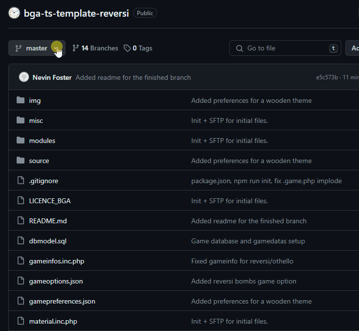<br>
</p>

## Steps 0, 1, 2, 3

Go to [TS Template: Tutorial](/docs/tutorials/index.md) for the first four steps of the tutorial. The first four steps for any project are the same. To avoid redundancy, they are not repeated here.

## Step 3.5 - From here on out

At this point, your are ready to start developing your game. You can follow any of the tutorials or guides on the [BGA Studio Documentation](https://en.doc.boardgamearena.com/Main_Page) to continue.

From this point in the tutorial and on:

- It will be assumed that files are built and synced before running the game in the BGA studio.
- It will be assumed that you perform a hard refresh of the client page after making changes.
- It will be assumed that you are using the default settings for initializing the typescript template. Adjustments can be made as needed and all sections have links to original file documentation for reference.
- Most steps will have specific instructions, but you can always adjust at your discretion.

*Make sure the following game information is set for Reversi:*
```json
// gameinfos.jsonc
{
	"players": [ 2 ],
	"bgg_id": 2389,
	"player_colors": [ "cbcbcb", "363636" ],
	"favorite_colors_support": false
}
```

## Step 4 - Game Board

1. Download the following board image for Reversi, and place it in the `img` folder in your project. It should be named `board.jpg` to match the SCSS background-image in the next step.

<p align="center">
	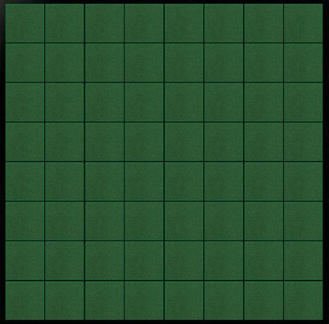
</p>

2. Add the board to the DOM by adding the following Smarty template code to the `yourgamename_yourgamename.tpl` file:

	```html
	<div id="board">
		<!-- BEGIN square -->
		<div id="square_{X}_{Y}" class="square" style="left: {LEFT}px; top: {TOP}px;"></div>
		<!-- END square -->
	</div>
	```

	> The `<!-- BEGIN <block> -->` and `<!-- END <block> -->` are Smarty template tags that let you programmatically generate HTML as you will use in a following step. See [X_X.tpl](https://en.doc.boardgamearena.com/Game_layout:_view_and_template:_yourgamename.view.php_and_yourgamename_yourgamename.tpl) for more information about the template file for BGA games.

3. Add the following SCSS to the `yourgamename.scss` file to style the board:

	```scss
	#board {
		// Setup Image
		width: 536px;
		height: 528px;
		background-image: url('img/board.jpg');
		// Center the board
		margin: auto;
		left: 0; top: 0; right: 0; bottom: 0;
		// Tokens and squares are absolutely placed relative to the board
		position: relative;
	}

	.square {
		// Size of a square
		width: 62px;
		height: 62px;
		// Position relative to the board, not affected by other elements.
		position: absolute;
		// Placeholder for validating the positions.
		background-color: red;
	}
	```

	> See [X.css](https://en.doc.boardgamearena.com/Game_interface_stylesheet:_yourgamename.css) for more information about the style sheet for BGA games.

	<p align="center">
	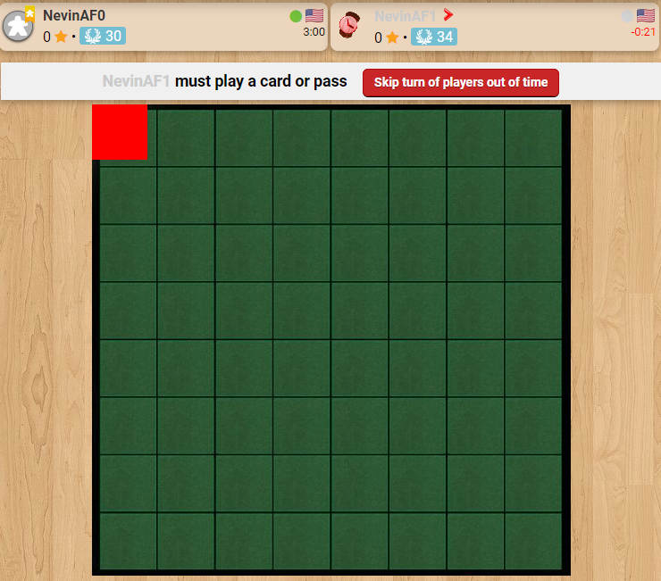<br>
	<i>Reloading the game (with a hard refresh).</i>
	</p>

4. Add the following code to the `yourgamename.view.php` file.

	```php
	// function build_page( $viewArgs ) {
	// ...
	/*********** Place your code below:  ************/

	// States that we should start inserting at the 'square' block
	// <yourgamename>_<yourgamename> should be replaced with your game name: tstemplatereversi_tstemplatereversi
	$this->page->begin_block( "<yourgamename>_<yourgamename>", "square" );

	$hor_scale = 64.8; // Constant for square width
	$ver_scale = 64.4; // Constant for square height
	for( $x=1; $x<=8; $x++ ) // Loop the 8 columns..
	{
		for( $y=1; $y<=8; $y++ ) // Loop the 8 rows..
		{
			// Inserts the code found at the square block based on the variables.
			$this->page->insert_block( "square", array(
				'X' => $x,
				'Y' => $y,
				'LEFT' => round( ($x-1)*$hor_scale+10 ),
				'TOP' => round( ($y-1)*$ver_scale+7 )
			) );
		}
	}
	```

	> See [X.view.php](https://en.doc.boardgamearena.com/Game_layout:_view_and_template:_yourgamename.view.php_and_yourgamename_yourgamename.tpl) for more information about the view file for BGA games.

	<p align="center">
	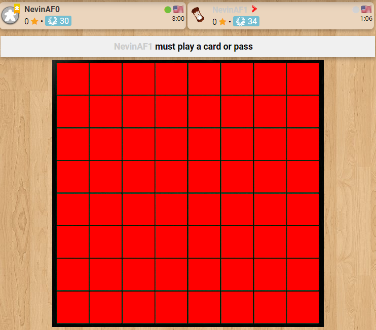<br>
	<i>Reloading the game (with a hard refresh).</i>
	</p>

## Step 5 - The Tokens

1. Add the following token image to the `img` folder in your project. It should be named `tokens.png` to match the SCSS background-image in the next step.

	<p align="center">
	
	</p>

2. Add a template variable to the `yourgamename_yourgamename.tpl` file to represent the tokens:

	```html
	<div id="board"> ... </div>

	<script type="text/javascript">

	var jstpl_token='<div class="token tokencolor_${color}" id="token_${x_y}"></div>';

	</script>
	```

	> Note that this does not have any information that needs to be populated by the server, so this could be directly defined in the TypeScript file.

3. Add the following SCSS to the `yourgamename.scss` file to style the tokens:

	```scss
	// Same as square, but matching the token size/image.
	.token {
		width: 56px;
		height: 56px;
		position: absolute;
		background-image: url('img/tokens.png');
	}
	// For clarity, but doesn't actually do anything.
	.tokencolor_cbcbcb { background-position: 0px 0px; }
	// Translate the background the exact size of the white token, so the black one shows instead.
	.tokencolor_363636 { background-position: -56px 0px; }
	```

4. Add a TypeScript function to the `yourgamename.ts` file to place the tokens on the board. You can hover over any function/property in the TypeScript file for its documentation and usage.

	```typescript
	///////////////////////////////////////////////////
	//// Utility methods

	/** Adds a token matching the given player to the board at the specified location. */
	addTokenOnBoard( x: number, y: number, player_id: number )
	{
		let player = this.gamedatas.players[ player_id ];
		if (!player)
			throw new Error( 'Unknown player id: ' + player_id );

		dojo.place( this.format_block( 'jstpl_token', {
			x_y: `${x}_${y}`,
			color: player.color
		} ) , 'board' );

		this.placeOnObject( `token_${x}_${y}`, `overall_player_board_${player_id}` );
		this.slideToObject( `token_${x}_${y}`, `square_${x}_${y}` ).play();
	}
	```

	> See [X.js](https://en.doc.boardgamearena.com/Game_interface_logic:_yourgamename.js) for more information about the script file for BGA games.

4. For a placeholder, test your tokens by manually placing some in the setup function. you can also remove the boilerplate code.:

	```typescript
	///////////////////////////////////////////////////
	//// Game setup

	setup(gamedatas: Gamedatas): void
	{
		console.log( "Starting game setup" );

		this.addTokenOnBoard( 2, 2, this.player_id );
		this.addTokenOnBoard( 6, 3, this.player_id );

		this.setupNotifications(); // <-- Keep this line
	}
	```

	<p align="center">
	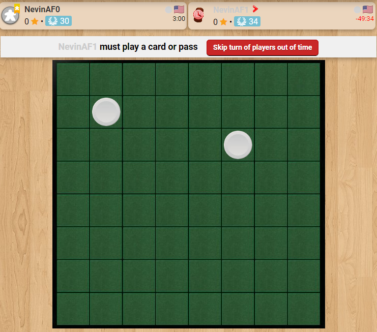<br>
	<i>Reloading the game (with a hard refresh).</i>
	</p>

## Step 6 - The Database and Initial Setup

1. Create a database for your board in the `dbmodel.sql` file:

	```sql
	CREATE TABLE IF NOT EXISTS `board` (
		`board_x` smallint(5) unsigned NOT NULL,
		`board_y` smallint(5) unsigned NOT NULL,
		`board_player` int(10) unsigned DEFAULT NULL,
		PRIMARY KEY (`board_x`,`board_y`)
	) ENGINE=InnoDB DEFAULT CHARSET=utf8;
	```

	Pay special attention to the backtick `` ` `` character vs. the single quote `'` when working with SQL. You can quit and restart your game to see if the file is correct.

	> See [dbmodel.sql](https://en.doc.boardgamearena.com/Game_database_model:_dbmodel.sql) for more information about the database file for BGA games.

2. Setup the board in your `yourgamename.game.php` file. This is initializing the data in the database and setting the four discs in the center of the board:

	```php
	protected function setupNewGame( $players, $options = array() )
	{
		//...
		$sql .= implode( ',', $values );
		self::DbQuery( $sql );
		// self::reattributeColorsBasedOnPreferences( $players, $gameinfos['player_colors'] );
		self::reloadPlayersBasicInfos();

		/************ Start the game initialization *****/
		$sql = "INSERT INTO board (board_x,board_y,board_player) VALUES ";
		$sql_values = array();
		list( $whiteplayer_id, $blackplayer_id ) = array_keys( $players );
		for( $x=1; $x<=8; $x++ )
		{
			for( $y=1; $y<=8; $y++ )
			{
				// Initial positions of white player
				if( ($x==4 && $y==4) || ($x==5 && $y==5) )
					$token_value = "'$whiteplayer_id'";
				// Initial positions of black player
				else if( ($x==4 && $y==5) || ($x==5 && $y==4) )
					$token_value = "'$blackplayer_id'";
				// Not a starting position
				else
					$token_value = "NULL";
				$sql_values[] = "('$x','$y',$token_value)";
			}
		}
		$sql .= implode( ',', $sql_values );
		self::DbQuery( $sql );
		//...
	}
	```

3. Now, we need to send the board information to the client whenever the page is reloaded. In your `yourgamename.game.php` file, add the following code to the `getAllDatas` function:

	```php
	protected function getAllDatas()
	{
		//...
		$sql = "SELECT board_x x, board_y y, board_player player
				FROM board WHERE board_player IS NOT NULL";
		$result['board'] = self::getObjectListFromDB( $sql );
		//...
	}
	```

4. Add the board data to the `Gamedatas` interface in the `yourgamename.d.ts` file:

	```typescript
	interface Gamedatas {
		board: { x: number, y: number, player: number }[];
	}
	```

5. Add the following to the `yourgamename.ts` file to place the discs at the start of a page load:

	```typescript
	setup(gamedatas: Gamedatas): void
	{
		console.log( "Starting game setup" );

		// Place the tokens on the board
		for( let i in gamedatas.board )
		{
			let square = gamedatas.board[i];

			if( square?.player ) // If square is defined and has a player
				this.addTokenOnBoard( square.x, square.y, square.player );
		}

		this.setupNotifications(); // <-- Keep this line
	}
	```

	<p align="center">
	<br>
	<i>Reloading the game (with a hard refresh).</i>
	</p>

## Step 7 - Game States

1. Replace the gamestates.jsonc file with the following:

	```json
	{
		"$schema": "../../node_modules/bga-ts-template/schema/gamestates.schema.json",

		// The initial state. Please do not modify.
		"1": {
			"name": "gameSetup",
			"description": "",
			"type": "manager",
			"action": "stGameSetup",
			"transitions": { "": 10 }
		},

		"10": {
			"name": "playerTurn",
			"description": "${actplayer} must play a disc",
			"descriptionmyturn": "${you} must play a disc",
			"type": "activeplayer",
			"args": "argPlayerTurn",
			"argsType": {
				"possibleMoves": "boolean[][]"
			},
			"possibleactions": {
				"playDisc": [
					{ "name": "x", "type": "AT_int" },
					{ "name": "y", "type": "AT_int" }
				]
			},
			"transitions": {
				"playDisc": 11,
				"zombiePass": 11
			}
		},

		"11": {
			"name": "nextPlayer",
			"type": "game",
			"action": "stNextPlayer",
			"updateGameProgression": true,
			"transitions": {
				"nextTurn": 10,
				"cantPlay": 11,
				"endGame": 99
			}
		},

		// Final state.
		// Please do not modify (and do not overload action/args methods}.
		"99": {
			"name": "gameEnd",
			"description": "End of game",
			"type": "manager",
			"action": "stGameEnd",
			"args": "argGameEnd",
			"argsType": "object"
		}
	}
	```

	There is a lot of information in this file. Most information can be found in the hover-over tooltips, but the [Game States](https://en.doc.boardgamearena.com/Your_game_state_machine:_states.inc.php) page has more information about the concepts.

	> This will automatically be converted to `gamestates.inc.php`, `yourgamename.action.php`, and `build/gamestates.d.ts` when you run `npm run build`.

2. Add placeholder functions to remove `Undefined method` errors. Add the following to your `yourgamename.action.php` file. Note that this replaces the large section of comments in the file describing the player actions, state arguments, and state actions.

	```php
	// Player actions
	function playDisc( int $x, int $y ) {
		/* TODO */
	}

	// Game state arguments
	function argPlayerTurn() {
		/* TODO */
	}

	// Game state actions
	function stNextPlayer() {
		/* TODO */
	}
	```

3. Fix the `dummmy` state errors in your `yourgamename.ts` file. These are added as a placeholder and now cause issues because there is no gamestate with the name `dummmy`:

	```typescript
	onEnteringState(stateName: GameStateName, args: CurrentStateArgs): void
	{
		console.log( 'Entering state: ' + stateName );
	}

	onLeavingState(stateName: GameStateName): void
	{
		console.log( 'Leaving state: ' + stateName );
	}

	onUpdateActionButtons(stateName: GameStateName, args: AnyGameStateArgs | null): void
	{
		console.log( 'onUpdateActionButtons: ' + stateName, args );
	}
	```

> You should no longer have any type issues in your files.

When you reload your game (this will cause current games to fail), you should see the banner change to `{actplayer} must play a disc` or `You must play a disc`. This will be the only visible change in the game at this point.

<p align="center">
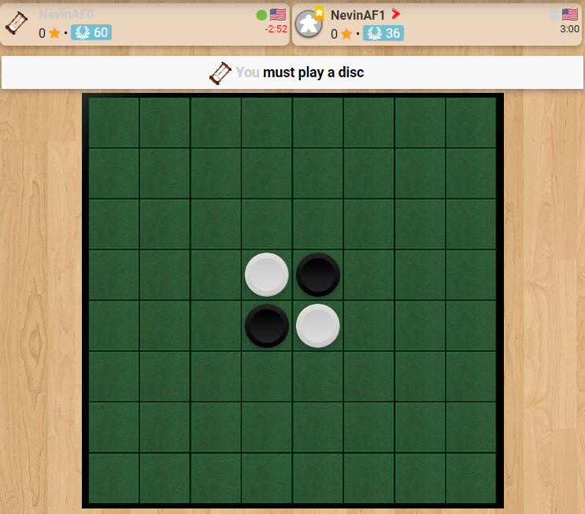<br>
<i>Reloading the game (with a hard refresh).</i>
</p>

## Step 8 - Game Rules and Possible Moves

There are a couple of variations on the rules for Reversi, but the most common is with `outflanking rules`. You can see the official rules at [World Othello](https://www.worldothello.org/about/about-othello/othello-rules/official-rules/). The rules have been implemented with the following utility functions.

1. Copy these functions into your `yourgamename.game.php` file:

	```php
	// Get the complete board with a double associative array
	function getBoard()
	{
		$sql = "SELECT board_x x, board_y y, board_player player FROM board";
		return self::getDoubleKeyCollectionFromDB( $sql, true );
	}

	// Get the list of possible moves (x => y => true)
	function getPossibleMoves( $player_id )
	{
		$result = array();

		$board = self::getBoard();

		for( $x=1; $x<=8; $x++ )
		{
			for( $y=1; $y<=8; $y++ )
			{
				$returned = self::getTurnedOverDiscs( $x, $y, $player_id, $board );
				if( count( $returned ) == 0 )
				{
					// No discs returned => not a possible move
				}
				else
				{
					// Okay => set this coordinate to "true"
					if( ! isset( $result[$x] ) )
						$result[$x] = array();

					$result[$x][$y] = true;
				}
			}
		}

		return $result;
	}

	// Get the list of returned disc when "player" we play at this place ("x", "y"),
	//  or a void array if no disc is returned (invalid move)
	function getTurnedOverDiscs( $x, $y, $player, $board )
	{
		$turnedOverDiscs = array();

		if( $board[ $x ][ $y ] === null ) // If there is already a disc on this place, this can't be a valid move
		{
			// For each directions...
			$directions = array(
				array( -1,-1 ), array( -1,0 ), array( -1, 1 ), array( 0, -1),
				array( 0,1 ), array( 1,-1), array( 1,0 ), array( 1, 1 )
			);

			foreach( $directions as $direction )
			{
				// Starting from the square we want to place a disc...
				$current_x = $x;
				$current_y = $y;
				$bContinue = true;
				$mayBeTurnedOver = array();

				while( $bContinue )
				{
					// Go to the next square in this direction
					$current_x += $direction[0];
					$current_y += $direction[1];

					if( $current_x<1 || $current_x>8 || $current_y<1 || $current_y>8 )
						$bContinue = false; // Out of the board => stop here for this direction
					else if( $board[ $current_x ][ $current_y ] === null )
						$bContinue = false; // An empty square => stop here for this direction
					else if( $board[ $current_x ][ $current_y ] != $player )
					{
						// There is a disc from our opponent on this square
						// => add it to the list of the "may be turned over", and continue on this direction
						$mayBeTurnedOver[] = array( 'x' => $current_x, 'y' => $current_y );
					}
					else if( $board[ $current_x ][ $current_y ] == $player )
					{
						// This is one of our disc

						if( count( $mayBeTurnedOver ) == 0 )
						{
							// There is no disc to be turned over between our 2 discs => stop here for this direction
							$bContinue = false;
						}
						else
						{
							// We found some disc to be turned over between our 2 discs
							// => add them to the result and stop here for this direction
							$turnedOverDiscs = array_merge( $turnedOverDiscs, $mayBeTurnedOver );
							$bContinue = false;
						}
					}
				}
			}
		}

		return $turnedOverDiscs;
	}
	```

2. Add the list of possible moves to the `argPlayerTurn` function in your `yourgamename.action.php` file:

	```php
	function argPlayerTurn()
	{
		$possibleMoves = self::getPossibleMoves( self::getActivePlayerId() );
		return array(
			'possibleMoves' => $possibleMoves
		);
	}
	```

3. Add a CSS class to represent the possible moves in your `yourgamename.scss` file:

	```scss
	.possibleMove {
		background-color: rgba(255, 255, 255, 0.15);
		cursor: pointer;
		transition: 100ms;
	}

	.possibleMove:hover {
		background-color: rgba(255, 255, 255, 0.3);
	}
	```

4. Add the possible moves to the board when entering a new state by adding the following to your `yourgamename.ts` file:

	```typescript
	// Utility methods

	/** Removes the 'possibleMove' class from all elements. */
	clearPossibleMoves() {
		document.querySelectorAll('.possibleMove').forEach(element => {
			element.classList.remove('possibleMove');
		});
	}

	/** Updates the squares on the board matching the possible moves. */
	updatePossibleMoves( possibleMoves: boolean[][] )
	{
		this.clearPossibleMoves();

		for( var x in possibleMoves )
		{
			for( var y in possibleMoves[ x ] )
			{
				let square = $(`square_${x}_${y}`);
				if( !square )
					throw new Error( `Unknown square element: ${x}_${y}. Make sure the board grid was set up correctly in the tpl file.` );
				square.classList.add('possibleMove');
			}
		}

		this.addTooltipToClass( 'possibleMove', '', _('Place a disc here') );
	}

	// Game & client states

	onEnteringState(stateName: GameStateName, args: CurrentStateArgs): void
	{
		console.log( 'Entering state: '+stateName );

		switch( stateName )
		{
			case 'playerTurn':
				this.updatePossibleMoves( args.args!.possibleMoves );
				break;
		}
	}
	```

	<p align="center">
	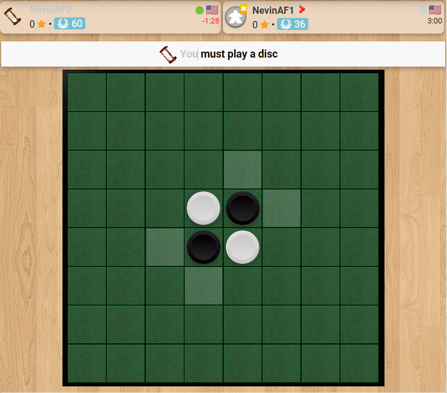<br>
	<i>Reloading the game (with a hard refresh).</i>
	</p>

The game is still not playable, but you can now see the possible moves for the first turn.

## Step 9 - Player Actions

1. Fill in the `playDisc`  function in your `yourgamename.action.php` file:

	```php
	function playDisc( int $x, int $y )
	{
		// Check that this player is active and that this action is possible at this moment
		self::checkAction( 'playDisc' );

		// Now, check if this is a possible move
		$board = self::getBoard();
		$player_id = self::getActivePlayerId();
		$turnedOverDiscs = self::getTurnedOverDiscs( $x, $y, $player_id, $board );

		if( count( $turnedOverDiscs ) <= 0 )
			throw new BgaSystemException( "Impossible move" );

		// This move is possible!

		// Let's place a disc at x,y and return all "$returned" discs to the active player
		$sql = "UPDATE board SET board_player='$player_id'
				WHERE ( board_x, board_y) IN ( ";
		foreach( $turnedOverDiscs as $turnedOver )
			$sql .= "('".$turnedOver['x']."','".$turnedOver['y']."'),";
		$sql .= "('$x','$y') ) ";

		self::DbQuery( $sql );

		// Update scores according to the number of disc on board
		$sql = "UPDATE player
				SET player_score = (
				SELECT COUNT( board_x ) FROM board WHERE board_player=player_id
				)";
		self::DbQuery( $sql );

		// Then, go to the next state
		$this->gamestate->nextState( 'playDisc' );
	}
	```

2. Fill in the `stNextPlayer` function in your `yourgamename.action.php` file:

	```php
	function stNextPlayer()
	{
		// Active next player
		$player_id = self::activeNextPlayer();

		// Check if both player has at least 1 discs, and if there are free squares to play
		$sql = "SELECT board_player, COUNT( board_x ) FROM board
				GROUP BY board_player";
		$player_to_discs = self::getCollectionFromDb( $sql, true );

		if( ! isset( $player_to_discs[ null ] ) )
		{
			// Index 0 has not been set => there's no more free place on the board !
			// => end of the game
			$this->gamestate->nextState( 'endGame' );
			return ;
		}
		else if( ! isset( $player_to_discs[ $player_id ] ) )
		{
			// Active player has no more disc on the board => he looses immediately
			$this->gamestate->nextState( 'endGame' );
			return ;
		}
		
		// Can this player play?

		$possibleMoves = self::getPossibleMoves( $player_id );
		if( count( $possibleMoves ) == 0 )
		{
			// This player can't play
			// Can his opponent play ?
			$opponent_id = self::getUniqueValueFromDb( "SELECT player_id FROM player WHERE player_id!='$player_id' " );
			if( count( self::getPossibleMoves( $opponent_id ) ) == 0 )
			{
				// Nobody can move => end of the game
				$this->gamestate->nextState( 'endGame' );
			}
			else
			{            
				// => pass his turn
				$this->gamestate->nextState( 'cantPlay' );
			}
		}
		else
		{
			// This player can play. Give him some extra time
			self::giveExtraTime( $player_id );
			$this->gamestate->nextState( 'nextTurn' );
		}
	}
	```

3. Connect an `onclick` function to all of the squares on the board:

	```typescript
	setup(gamedatas: Gamedatas): void
	{
		// ...
		dojo.query( '.square' ).connect( 'onclick', this, 'onPlayDisc' );
		// ...
	}

4. Add the `onPlayDisc` function to your `yourgamename.ts` file:

	```typescript
	// Player's action

	/** Called when a square is clicked, check if it is a possible move and send the action to the server. */
	onPlayDisc( evt: Event )
	{
		// Stop this event propagation
		evt.preventDefault();

		if (!(evt.currentTarget instanceof HTMLElement))
			throw new Error('evt.currentTarget is null! Make sure that this function is being connected to a DOM HTMLElement.');

		// Check if this is a possible move
		if( !evt.currentTarget.classList.contains('possibleMove') )
			return;

		// Check that this action is possible at this moment (shows error dialog if not possible)
		if( !this.checkAction( 'playDisc' ) )
			return;

		// Get the clicked square x and y
		// Note: square id format is "square_X_Y"
		let [_square_, x, y] = evt.currentTarget.id.split('_');

		this.ajaxcall( `/${this.game_name}/${this.game_name}/playDisc.html`, {
			x, y, lock: true
		}, this, function() {} );
	}
	```

Now you should be able to play the game! However, you will need to reload the game after every move to force the board to update.

## Step 10 - Notifications

Notifications are used to inform players when something happens in the game. In our case, we only need to send one notification stating when the player has played a disc; however, it is often much more useful to send the notifications as a sequence of events so they can be automatically sequenced in the client. In this case, we will send three notifications:=, all of which can be sent from the player action function:
- When a player plays a disc
- When discs are converted because of a move
- When the scores

1. Add the following to the `playDisc` function in your `yourgamename.action.php` file:

	```php
	function playDisc( int $x, int $y )
	{
		// ...

		// Notify
		self::notifyAllPlayers( "playDisc", clienttranslate( '${player_name} plays a disc and turns over ${returned_nbr} disc(s)' ), array(
			'player_id' => $player_id,
			'player_name' => self::getActivePlayerName(),
			'returned_nbr' => count( $turnedOverDiscs ),
			'x' => $x,
			'y' => $y
		) );

		self::notifyAllPlayers( "turnOverDiscs", '', array(
			'player_id' => $player_id,
			'turnedOver' => $turnedOverDiscs
		) );
		
		$newScores = self::getCollectionFromDb( "SELECT player_id, player_score FROM player", true );
		self::notifyAllPlayers( "newScores", "", array(
			"scores" => $newScores
		) );

		// Then, go to the next state
		$this->gamestate->nextState( 'playDisc' );
	}
	```

2. Add the notifications to your `NotifTypes` interface in the `yourgamename.d.ts` file:

	```typescript
	interface NotifTypes {
		'playDisc': { x: number, y: number, player_id: number };
		'turnOverDiscs': {
			player_id: number,
			turnedOver: { x: number, y: number }[]
		},
		'newScores': { scores: Record<number, number> };
	}
	```

3. Add the following to your `yourgamename.ts` file to listen and handle the notifications:

	```typescript
	setupNotifications()
	{
		console.log( 'notifications subscriptions setup' );

		dojo.subscribe( 'playDisc', this, "notif_playDisc" );
		this.notifqueue.setSynchronous( 'playDisc', 500 );
		dojo.subscribe( 'turnOverDiscs', this, "notif_turnOverDiscs" );
		this.notifqueue.setSynchronous( 'turnOverDiscs', 1000 );
		dojo.subscribe( 'newScores', this, "notif_newScores" );
		this.notifqueue.setSynchronous( 'newScores', 500 );
	}

	notif_playDisc( notif: NotifAs<'playDisc'> )
	{
		this.clearPossibleMoves();
		this.addTokenOnBoard( notif.args.x, notif.args.y, notif.args.player_id );
	}

	notif_turnOverDiscs( notif: NotifAs<'turnOverDiscs'> )
	{
		// Change the color of the turned over discs
		for( var i in notif.args.turnedOver )
		{
			let token_data = notif.args.turnedOver[ i ]!;
			let token = $<HTMLElement>( `token_${token_data.x}_${token_data.y}` );

			if (!token)
				throw new Error( `Unknown token element: ${token_data.x}_${token_data.y}. Make sure the board grid was set up correctly in the tpl file.` );

			token.classList.toggle('tokencolor_cbcbcb');
			token.classList.toggle('tokencolor_363636');
		}
	}

	notif_newScores( notif: NotifAs<'newScores'> )
	{
		for( var player_id in notif.args.scores )
		{
			let counter = this.scoreCtrl[ player_id ];
			let newScore = notif.args.scores[ player_id ];
			if (counter && newScore)
				counter.toValue( newScore );
		}
	}
	```

4. (optional) Add a flipping animation to the token when the classes:

	*yourgamename_yourgamename.tpl*
	```html
	// Updated token template
	var jstpl_token = '<div class="token-container tokencolor_${color}" id="token_${x_y}"><div class="token-flip"><div class="token-white"></div><div class="token-black"></div></div></div>';
	```

	*yourgamename.scss*
	```scss
	.token-container {
		background-color: transparent;
		width: 56px;
		height: 56px;
		perspective: 250px;
		position: absolute;
	}

	.token-flip {
		position: relative;
		width: 100%;
		height: 100%;
		text-align: center;
		transition: transform 1.2s;
		transform-style: preserve-3d;
		border-radius:50%;
		box-shadow: 0 4px 8px 0 rgba(0,0,0,0.25);
	}

	.tokencolor_363636 > .token-flip { transform: rotateY(180deg); }

	.token-white, .token-black {
		position: absolute;
		width: 100%;
		height: 100%;
		-webkit-backface-visibility: hidden;
		backface-visibility: hidden;
		background-image: url("img/tokens.png");
	}

	.token-white {
		background-position: 0px 0px;
	}

	.token-black {
		background-position: -56px 0px;
		transform: rotateY(180deg);
	}
	```

	<p align="center">
	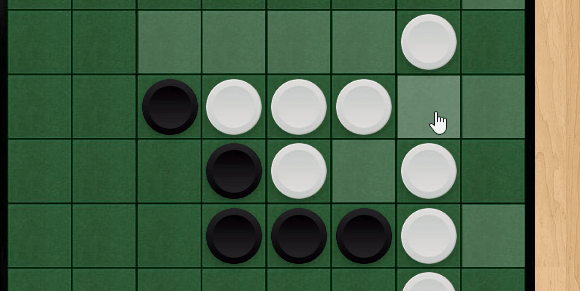
	</p>

At this point, you now have a fully functional game that can be played on BGA. The following steps are to add flourishes and additional features to the game.

## (optional) Step 11 - Statistics

Statistics are mostly optional and are a fun way to compare player strategies or how much they have played the game.

1. Replace the contents of `shared/stats.jsonc` with the following:

	```json
	{
		"$schema": "../../node_modules/bga-ts-template/schema/stats.schema.json",
		// All of these stats are tracked per player
		"player": {
			"discPlayedOnCorner": {
				"id": 10,
				"name": "Discs played on a corner",
				"type": "int"
			},
			"discPlayedOnBorder": {
				"id": 11,
				"name": "Discs played on a border",
				"type": "int"
			},
			"discPlayedOnCenter": {
				"id": 12,
				"name": "Discs played on board center part",
				"type": "int"
			},
			"turnedOver": {
				"id": 13,
				"name": "Number of discs turned over",
				"type": "int"
			}
		}
	}
	```

	> See [stats.json](https://en.doc.boardgamearena.com/Game_statistics:_stats.json) for more information about the stats file for BGA games.

2. Add the following to the `playDisc` function in your `yourgamename.action.php` file:

	```php
	function playDisc( int $x, int $y )
	{
		//...
		// Update scores...

		// Statistics
		self::incStat( count( $turnedOverDiscs ), "turnedOver", $player_id );
		if( ($x==1 && $y==1) || ($x==8 && $y==1) || ($x==1 && $y==8) || ($x==8 && $y==8) )
			self::incStat( 1, 'discPlayedOnCorner', $player_id );
		else if( $x==1 || $x==8 || $y==1 || $y==8 )
			self::incStat( 1, 'discPlayedOnBorder', $player_id );
		else if( $x>=3 && $x<=6 && $y>=3 && $y<=6 )
			self::incStat( 1, 'discPlayedOnCenter', $player_id );

		// Notify...
	}
	```

3. Reload the statistics configuration on the manage game page. See [Step 3.3](/docs/tutorials/index.md#step-3---game-information--metadata) for more information.

	<p align="center">
	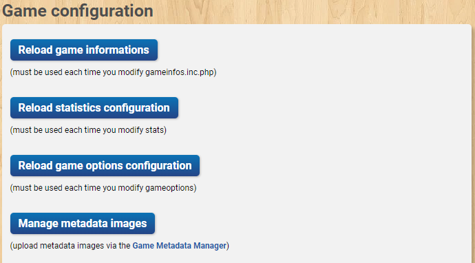
	</p>

4. Play a game and verify that your new statistics are visible at the end of the game:

	<p align="center">
	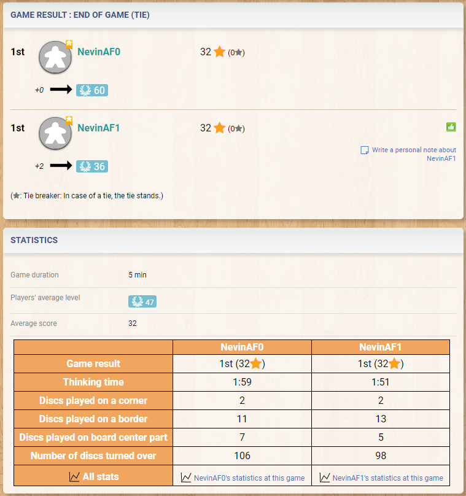
	</p>

## (Optional) Step 12 - Game Options

Game options are a way for users to change game behavior or rules. For example, we will add another rule variant called "Reversi Bombs" that flips all 8 adjacent discs when a disc is played.

<p align="center">
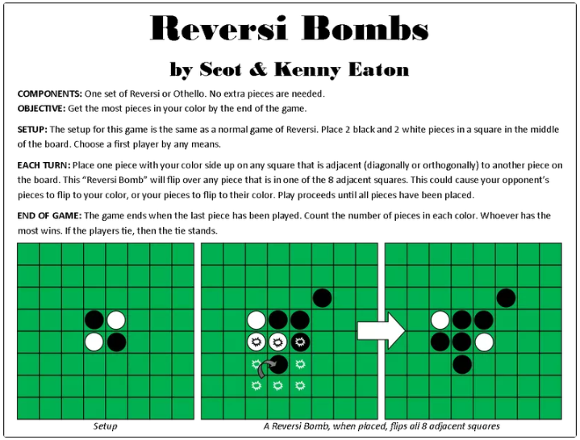
</p>

1. Replace your gameoptions with the following in the `shared/gameoptions.jsonc` file:

	```json
	{
		"$schema": "../../node_modules/bga-ts-template/schema/gameoptions.schema.json",

		"100": {
			"name": "Variant",
			"values": {
				// This is the current rule set we have implemented
				"1": {
					"name": "Standard",
					"description": "Flip all outflanked discs."
				},
				"2": {
					"name": "Reversi Bombs",
					"description": "Flip all 8 adjacent discs."
				}
			}
		}
	}
	```

	> See [gameoptions.json](https://en.doc.boardgamearena.com/Options_and_preferences:_gameoptions.json,_gamepreferences.json) for more information about the options file for BGA games.

2. Modify the `getTurnedOverDiscs` function in your `yourgamename.game.php` file to handle the new game option:

	```php
	function getTurnedOverDiscs( $x, $y, $player, $board )
	{
		//...

		foreach( $directions as $direction )
		{
			// If game option '100' is set to 2 (reversi bombs)
			if ($this->gamestate->table_globals[100] == 2)
			{
				$current_x = $x + $direction[0];
				$current_y = $y + $direction[1];
				if( $current_x<1 || $current_x>8 || $current_y<1 || $current_y>8 )
					continue; // Out of the board => stop here for this direction

				if ($board[ $current_x ][ $current_y ] !== null)
					// push the disc to be turned over
					$turnedOverDiscs[] = array( 'x' => $current_x, 'y' => $current_y );

				continue; // Don't do standard game logic
			}
			// Standard...
		}

		//...
	}
	```

3. Fix the `playDisc` function to flip all turned discs instead of setting them to the active player:

	```php
	// Let's place a disc at x,y and return all "$returned" discs to the active player
	$other_id = self::getUniqueValueFromDb( "SELECT player_id FROM player WHERE player_id!='$player_id'" );
	$sql = "UPDATE board SET board_player = CASE WHEN board_player = '$player_id' THEN '$other_id' ELSE '$player_id' END WHERE (board_x, board_y) IN (";
	foreach( $turnedOverDiscs as $turnedOver )
		//...
	```

4. Reload the game options from within the game manager page.  See [Step 3.3](/docs/tutorials/index.md#step-3---game-information--metadata) for more information.

	<p align="center">
	
	</p>

<p align="center">
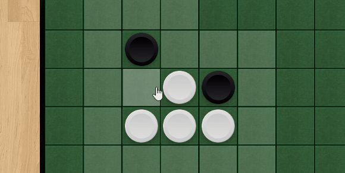
</p>

## User Preferences

User preferences are something cosmetic about the game interface that you want users to be able to control.

Reversi has a classic aesthetic, but in this example, we will add a user preference to change the style of the board. This is not a great use case for user preferences, but it is a simple example.

1. Replace the contents of `shared/gamepreferences.jsonc` with the following:

	```json
	{
		"$schema": "../../node_modules/bga-ts-template/schema/gamepreferences.schema.json",
		"101": {
			"name": "Game Style",
			"needReload": true,
			"values": {
				"1": {
					"name": "Classic",
					"cssPref": "game_style_classic"
				},
				"2": {
					"name": "Wooden",
					// Then this is added to the page, we will override the image urls in the css.
					"cssPref": "game_style_wooden"
				}
			},
			"default": 1
		}
	}
	```

	> See [gamepreferences.json](https://en.doc.boardgamearena.com/Options_and_preferences:_gameoptions.json,_gamepreferences.json) for more information about the options file for BGA games.

2. Download the following images and add them to your `img` folder. They should be named 'wooden_board.jpg' and 'wooden_tokens.png'.

	<table align="center" width="50%"><tr><td>
	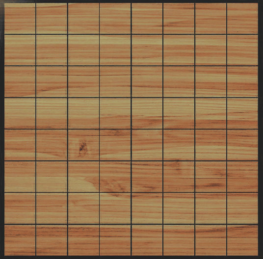
	</td><td>
	
	</td></tr></table>

3. Add the following to your `yourgamename.scss` file to change the board and token images:

	```scss
	// This overrides the #board + .token- images when the .game_style_wooden is automatically added to the page (by the user preference).
	.game_style_wooden {
		#board {
			background-image: url('img/wooden_board.jpg');
		}
		.token-white, .token-black {
			background-image: url('img/wooden_tokens.png');
		}
	}
	```

4. Refresh the game options on the game manager page. See [Step 3.3](/docs/tutorials/index.md#step-3---game-information--metadata) for more information.

	<p align="center">
	
	</p>

5. Reload the game and change the user preference to see the new board and token images:

	<p align="center">
	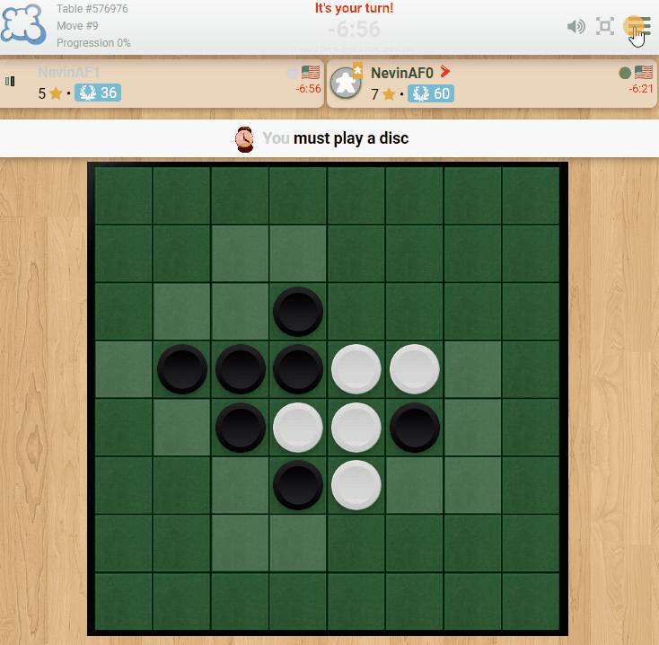
	</p>
